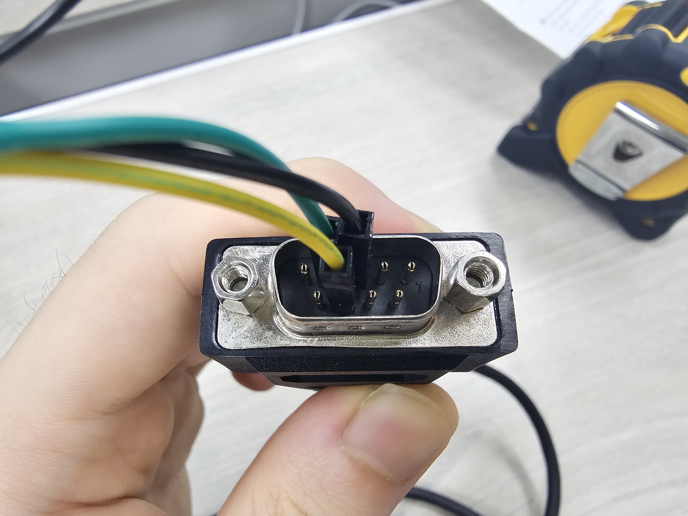
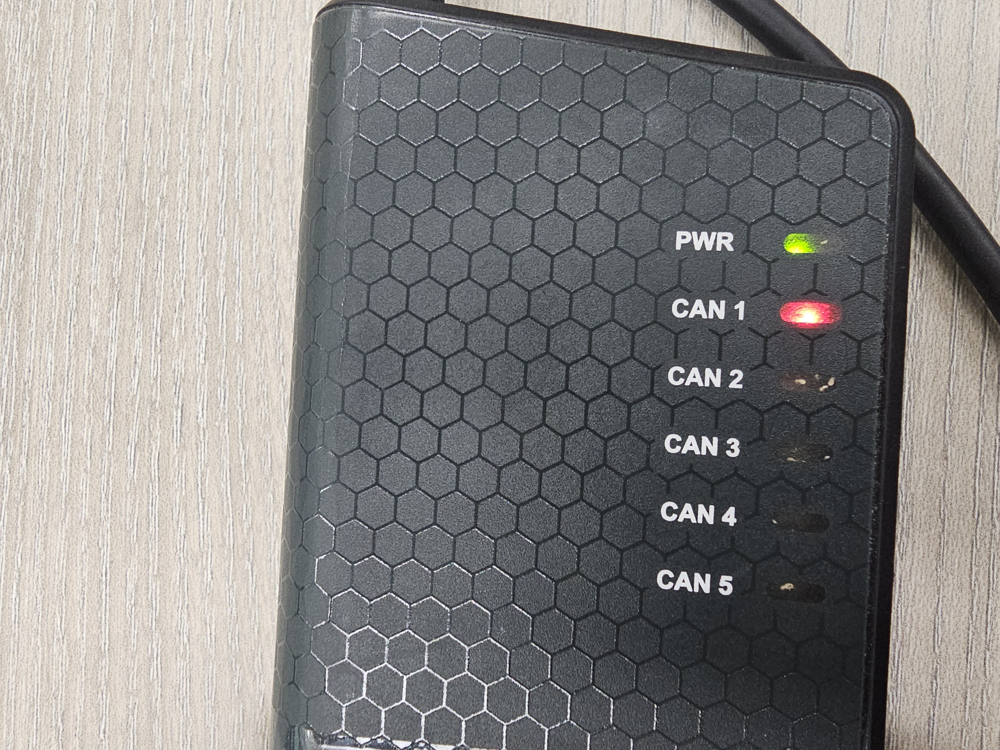

## Run Delphi ESR 2.5 RADAR on ROS 2
* [English](README.md)
* [한국어(Korean)](README_ko.md)

Working environment: Ubuntu 20.04 & ROS 2 Foxy

### 1. Install Dependencies
```bash
sudo apt install net-tools can-utils ros-$ROS_DISTRO-ros2-socketcan
```

#### Install the Delphi ESR Driver
```bash
sudo apt update && sudo apt install apt-transport-https
sudo sh -c 'echo "deb [trusted=yes] https://s3.amazonaws.com/autonomoustuff-repo/ $(lsb_release -sc) main" > /etc/apt/sources.list.d/autonomoustuff-public.list'
sudo apt update
sudo apt install ros-$ROS_DISTRO-delphi-esr
```

> [!WARNING]     
> As of July 2025, the ROS `delphi-esr` package is only supported up to Ubuntu 22.04. Please refer to the table below for detailed support status.

* ROS 1

| ROS Versions     | Supported Ubuntu Versions | Supported Windows Versions |
|------------------|---------------------------|----------------------------|
| Indigo Igloo     | 13.10, **14.04**          | -                          |
| Kinetic Kame     | 15.10, **16.04**          | -                          |
| Lunar Loggerhead | **16.04**, 16.10, 17.04   | -                          |
| Melodic Morenia  | 17.10, **18.04**          | 10                         |
| Noetic Ninjemys  | **20.04**                 | (Experimental Support)     |

* ROS 2

| ROS Versions     | Supported Ubuntu Versions | Supported Windows Versions |
|------------------|---------------------------|----------------------------|
| Foxy Fitzroy     | **20.04**                 | 10                         |
| Humble Hawksbill | **22.04**                 | 10                         |

### 2. Connect a USB-to-CAN Device and Establish CAN Communication


A total of 7 lines out of the Delphi ESR 2.5 radar as shown in the picture above. Among them, red, white, and black are power lines, and yellow and green are CAN communication lines.


Connect the radar's power line to the 24 V power supply. Red and white one go to the VCC and black one goes to the GND.



Connect the CAN communication line of the radar to the CAN terminal as shown above.


Finally, connect the USB-to-CAN device to the computer. [Kvaser USBcan Pro 5xHS](https://kvaser.com/product/kvaser-usbcan-pro-5xhs/) is used here.

When entering `sudo dmesg`, you should watch that the device is connected through USB as shown below.

```bash
$ sudo dmesg

[67879.654473] usb 1-4: new high-speed USB device number 9 using xhci_hcd
[67879.803090] usb 1-4: New USB device found, idVendor=0bfd, idProduct=(16진수), bcdDevice= 0.01
[67879.803118] usb 1-4: New USB device strings: Mfr=1, Product=2, SerialNumber=0
[67879.803127] usb 1-4: Product: Kvaser USBcan Pro 5xHS
[67879.803134] usb 1-4: Manufacturer: Kvaser AB
```

In Linux, when the device is connected, the kernel modules (`can`, `kvaser_usb`) are automatically loaded. To check whether the kernel module has been properly loaded, enter the command below.

```bash
$ lsmod | grep -e "can" -e "kvaser_usb"

can_bcm                24576  0
kvaser_usb             53248  0
can_dev                45056  1 kvaser_usb
can_raw                20480  2
can                    24576  2 can_raw,can_bcm
```

If it does not appear as above, manually load the kernel module through `modprobe`.

```bash
sudo modprobe can
sudo modprobe kvaser_usb
```


At this point, only 'PWR' lights up as shown in the photo above, and 'CAN 1' does not light up even though the line is physically connected to 'CAN 1' terminal.

Now, establish a CAN communication connection through the command below. `can0` is an example, and you can freely change it.

500000 denotes that the Baud rate is set to 500 kbps. this speed is one of the standards of CAN communication.

```bash
sudo ip link set can0 type can bitrate 500000
sudo ifconfig can0 up
```

Check that the connection is established.

```bash
$ ifconfig can0

can0: flags=128<UP,RUNNING,NOARP>  mtu 16
        unspec 00-00-00-00-00-00-00-00-00-00-00-00-00-00-00-00  txqueuelen 10  (UNSPEC)
        RX packets 19606  bytes 156848 (156.8 KB)
        RX errors 0  dropped 0  overruns 0  frame 0
        TX packets 0  bytes 0 (0.0 B)
        TX errors 0  dropped 0 overruns 0  carrier 0  collisions 0
```

If the connection is not established, it will be shown as below. Unlike the above, you can see that 'UP, RUNNING' does not appear.

```bash
$ ifconfig can0

can0: flags=128<NOARP>  mtu 16
        unspec 00-00-00-00-00-00-00-00-00-00-00-00-00-00-00-00  txqueuelen 10  (UNSPEC)
        RX packets 0  bytes 0 (0.0 B)
        RX errors 0  dropped 0  overruns 0  frame 0
        TX packets 0  bytes 0 (0.0 B)
        TX errors 0  dropped 0 overruns 0  carrier 0  collisions 0
```


Also, 'CAN 1' should now be lit.

> [!NOTE]
>
>
>
> If the red light, not orange, is lit, the CAN wiring is wrong.

You can check the data entering the can0 in real-time through `canniffer -c can0`.

```bash
01 delta   ID  data ...                  < cansniffer can0 # l=20 h=100 t=500 >
0.200789  4E0  80 1F FF 64 36 00 00 00 ...d6...
0.200770  4E1  FE 10 00 4E 00 00 03 4D ...N...M
0.200774  4E3  0E 00 00 00 00 00 00 00 ........
0.201029  540  00 0A 0A 0A 0A 0A 0A 0A ........
0.400828  5E4  83 85 78 8A C0 00 00 58 ..x....X
0.250547  5E5  8A 85 61 60 00 00 00 00 ..a`....
0.200778  5E9  C8 4F 00 04 1A 00 02 04 .O......
0.201020  5EF  32 00 01 04 04 0B 32 00 2.....2.
```

### 3. Run the ROS Nodes
```bash
ros2 launch radar_visualizer delphi_visualization_pretty.launch.xml
```

#### Configuration of the `delphi_esr` package
* Launch files
  * `delphi_esr_can.launch.xml`: receive radar data via CAN communication 
  * `delphi_esr_eth.launch.xml`: receive radar data via Ethernet communication
  * (`delphi_esr_viz.launch.xml`: internal launch file that converts raw data into visual one)

* Nodes
  * `delphi_esr_can_node`
  * `delphi_esr_eth_node`
  * `delphi_esr_viz_node`

#### Configuration of the `radar_visualizer` package
* Launch file
  * `delphi_visualization_pretty.launch.xml`: convert visualization data received by CAN communication to look good

* Node
  * `radar_visualizer_node`

#### Parameters of the launch file 
* `frame_id`: Reference Frame ID for the coordinate systems. Must have the same value as the `Fixed Frame` specified in rviz (default: `radar_1`).
* `esr_upside_down`: Whether to flip the coordinate value upside down. Used when the radar is installed upside down (default: `false`).
* `use_kvaser`: Whether to communicate with the Kvaser Interface (default: `false`).
  * `kvaser_hardware_id`: Hardware ID of Kvaser USBcan (default: `10000`).
  * `kvaser_circuit_id`: CAN device number (default: `0`).
* `use_socketcan`: Whether to communicate with Linux SocketCAN (default: `true`).
  * `Socketcan_device`: Interface name of CAN communication (default: `can0`).
* `marker_duration`: retention period of object markers from the RADAR (default: `0.16` seconds)
* `marker_duration_velocity`: retention period of object markers with speed information from the RADAR (default: `5.0` seconds)

> [!NOTE]     
> In this case, communication is performed using the [Linux SocketCAN](https://index.ros.org/p/ros2_socketcan/), not the [Kvaser Interface](https://github.com/astuff/kvaser_interface). For more information on using the Kvaser Interface, refer to [Populate CAN Hardware and Circuit IDs](https://autonomoustuff.atlassian.net/wiki/spaces/RW/pages/17472305/Populate+CAN+Hardware+and+Circuit+IDs) article from the AutonomousStuff ROS Wiki.

### 4. Execution Results


Orange markers indicate the positions of the identified objects, and the numbers on them are the IDs of the objects. The Delphi ESR ROS driver provides the ability to track objects by itself.

Green markers indicate positions of objects including velocity information.

### References
* [AutonomouStuff ROS Wiki, "Driver Pack Installation or Upgrade Instructions"](https://autonomoustuff.atlassian.net/wiki/spaces/RW/pages/17475947/Driver+Pack+Installation+or+Upgrade+Instructions)
* [이용욱, "Get the car information through Socket CAN"](https://velog.io/@qaszx1004/SocketCAN%EC%9C%BC%EB%A1%9C-%EC%B0%A8%EB%9F%89-%EC%A0%95%EB%B3%B4-%EB%B0%9B%EC%95%84%EC%98%A4%EA%B8%B0)
* [하늘땅별땅, "Managing Linux Module: About Modprobe"](https://blog.naver.com/hymne/221055894500)
* [https://github.com/ancabilloni/ros-delphi-esr-visualization](https://github.com/ancabilloni/ros-delphi-esr-visualization)