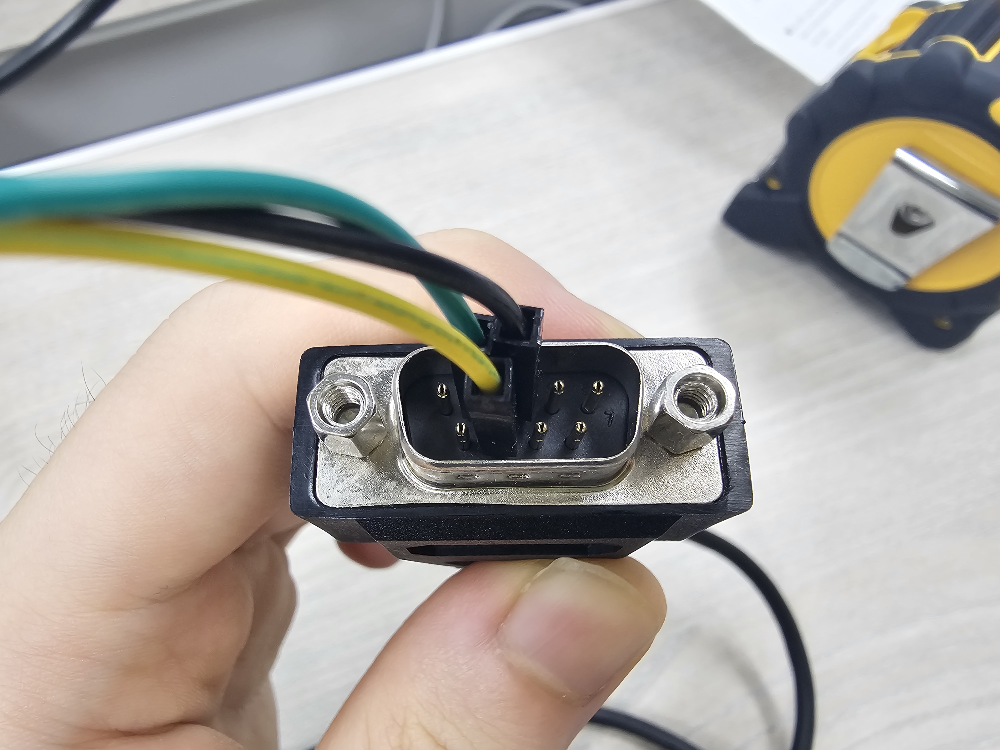
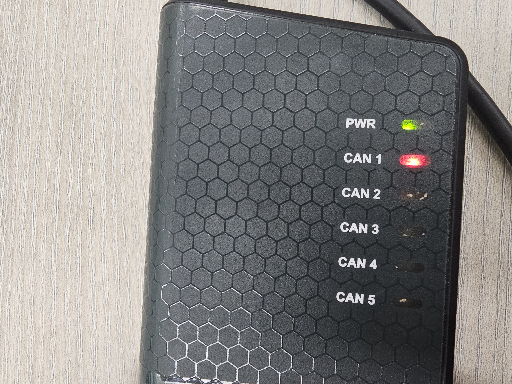

## ROS 2에서 Delphi ESR 2.5 레이다 구동
* [English](README.md)
* [한국어(Korean)](README_ko.md)

작업 환경: Ubuntu 20.04, ROS 2 Foxy

### 1. 의존성 설치
```bash
sudo apt install net-tools can-utils ros-$ROS_DISTRO-ros2-socketcan
```

#### Delphi ESR 드라이버 설치
```bash
sudo apt update && sudo apt install apt-transport-https
sudo sh -c 'echo "deb [trusted=yes] https://s3.amazonaws.com/autonomoustuff-repo/ $(lsb_release -sc) main" > /etc/apt/sources.list.d/autonomoustuff-public.list'
sudo apt update
sudo apt install ros-$ROS_DISTRO-delphi-esr
```

> [!WARNING]     
> 2025년 7월 현재 ROS `delphi-esr` 패키지는 Ubuntu 22.04까지밖에 지원하지 않는다. 자세한 지원 현황은 아래 표를 참고.

* ROS 1

| ROS 버전          | 지원하는 우분투 버전        | 지원하는 윈도우 버전 |
|------------------|-------------------------|------------------|
| Indigo Igloo     | 13.10, **14.04**        | -                |
| Kinetic Kame     | 15.10, **16.04**        | -                |
| Lunar Loggerhead | **16.04**, 16.10, 17.04 | -                |
| Melodic Morenia  | 17.10, **18.04**        | 10               |
| Noetic Ninjemys  | **20.04**               | (실험적 지원)      |

* ROS 2

| ROS 버전          | 지원하는 우분투 버전 | 지원하는 윈도우 버전 |
|------------------|------------------|------------------|
| Foxy Fitzroy     | **20.04**        | 10               |
| Humble Hawksbill | **22.04**        | 10               |

### 2. USB to CAN 기기 연결 및 CAN 통신 설정


Delphi ESR 2.5 레이다에서는 위 사진과 같이 총 7개의 선이 나온다. 이 중에서 빨간색, 흰색, 검은색은 전원선이고, 노란색과 초록색은 CAN 통신 선이다.


24 V 전원 공급 장치에 레이다의 전원선을 연결한다. 빨간색과 흰색이 VCC, 검은색이 GND로 가게 한다.



CAN 단자에 레이다의 CAN 통신선을 위 사진과 같이 연결한다.


마지막으로 USB to CAN 장치를 컴퓨터에 연결한다. 여기서는 [Kvaser USBcan Pro 5xHS](https://kvaser.com/product/kvaser-usbcan-pro-5xhs/)를 사용하였다.

`sudo dmesg`를 쳤을 때 아래와 같이 USB를 통해 장치가 연결되었다는 기록이 떠야 한다.

```bash
$ sudo dmesg

[67879.654473] usb 1-4: new high-speed USB device number 9 using xhci_hcd
[67879.803090] usb 1-4: New USB device found, idVendor=0bfd, idProduct=(16진수), bcdDevice= 0.01
[67879.803118] usb 1-4: New USB device strings: Mfr=1, Product=2, SerialNumber=0
[67879.803127] usb 1-4: Product: Kvaser USBcan Pro 5xHS
[67879.803134] usb 1-4: Manufacturer: Kvaser AB
```

리눅스에서는 기본적으로 장치가 연결될 때 자동으로 필요한 커널 모듈(`can`, `kvaser_usb`)을 불러온다. 커널 모듈이 제대로 불러와졌는지 확인하려면 아래 명령어를 입력한다.

```bash
$ lsmod | grep -e "can" -e "kvaser_usb"

can_bcm                24576  0
kvaser_usb             53248  0
can_dev                45056  1 kvaser_usb
can_raw                20480  2
can                    24576  2 can_raw,can_bcm
```

만약 위와 같이 뜨지 않을 경우 `modprobe`를 통해 수동으로 커널 모듈을 불러온다.

```bash
sudo modprobe can
sudo modprobe kvaser_usb
```


이 시점에서는 위 사진과 같이 PWR에만 불이 들어오고, CAN 1 단자에 물리적으로 선을 연결했음에도 CAN 1에는 불이 들어오지 않는다.

이제 아래 명령어를 통해 CAN 통신 연결을 수립한다. 여기서 `can0`은 예시로, 원하는 이름으로 바꾸어도 된다.

여기서 500000은 Baud rate를 500 kbps로 설정하겠다는 의미이다. 500 kbps는 CAN 통신의 표준 속도 중 하나이다.

```bash
sudo ip link set can0 type can bitrate 500000
sudo ifconfig can0 up
```

연결이 수립되었는지 확인한다.

```bash
$ ifconfig can0

can0: flags=128<UP,RUNNING,NOARP>  mtu 16
        unspec 00-00-00-00-00-00-00-00-00-00-00-00-00-00-00-00  txqueuelen 10  (UNSPEC)
        RX packets 19606  bytes 156848 (156.8 KB)
        RX errors 0  dropped 0  overruns 0  frame 0
        TX packets 0  bytes 0 (0.0 B)
        TX errors 0  dropped 0 overruns 0  carrier 0  collisions 0
```

연결이 수립되지 않았을 경우 아래와 같이 표시된다. 위와는 달리 `UP,RUNNING`이 뜨지 않는 모습을 볼 수 있다.

```bash
$ ifconfig can0

can0: flags=128<NOARP>  mtu 16
        unspec 00-00-00-00-00-00-00-00-00-00-00-00-00-00-00-00  txqueuelen 10  (UNSPEC)
        RX packets 0  bytes 0 (0.0 B)
        RX errors 0  dropped 0  overruns 0  frame 0
        TX packets 0  bytes 0 (0.0 B)
        TX errors 0  dropped 0 overruns 0  carrier 0  collisions 0
```


또한 이제 CAN 1에도 불이 들어와야 한다.

> [!NOTE]
>
> 
>
> 주황색이 아닌 빨간색 불이 들어왔다면 CAN 배선이 잘못된 것이다.

`cansniffer -c can0`을 통해 can0으로 들어오는 데이터를 실시간으로 확인할 수 있다.

```bash
01 delta   ID  data ...                  < cansniffer can0 # l=20 h=100 t=500 >
0.200789  4E0  80 1F FF 64 36 00 00 00 ...d6...
0.200770  4E1  FE 10 00 4E 00 00 03 4D ...N...M
0.200774  4E3  0E 00 00 00 00 00 00 00 ........
0.201029  540  00 0A 0A 0A 0A 0A 0A 0A ........
0.400828  5E4  83 85 78 8A C0 00 00 58 ..x....X
0.250547  5E5  8A 85 61 60 00 00 00 00 ..a`....
0.200778  5E9  C8 4F 00 04 1A 00 02 04 .O......
0.201020  5EF  32 00 01 04 04 0B 32 00 2.....2.
```

### 3. ROS Node 구동
```bash
ros2 launch radar_visualizer delphi_visualization_pretty.launch.xml
```

#### `delphi_esr` 패키지의 구성
* launch 파일
  * `delphi_esr_can.launch.xml`: CAN 통신을 통해 레이다 데이터를 수신 
  * `delphi_esr_eth.launch.xml`: 이더넷 통신을 통해 레이다 데이터를 수신
  * (`delphi_esr_viz.launch.xml`: raw data를 시각적인 데이터로 변환해 주는 내부 launch 파일)

* Node
  * `delphi_esr_can_node`
  * `delphi_esr_eth_node`
  * `delphi_esr_viz_node`

#### `radar_visualizer` 패키지의 구성
* launch 파일
  * `delphi_visualization_pretty.launch.xml`: CAN 통신으로 받은 시각화 데이터를 보기 좋게 변환

* Node
  * `radar_visualizer_node`

#### launch 파일 매개변수
* `frame_id`: 좌표계 기준틀 ID. rviz에서 지정한 `Fixed Frame`과 값이 같아야 한다(기본값: `radar_1`).
* `esr_upside_down`: 좌표값을 위아래로 뒤집을지의 여부. 레이다를 거꾸로 설치했을 때 사용한다(기본값: `false`).
* `use_kvaser`: Kvaser Interface로 통신할지의 여부(기본값: `false`).
  * `kvaser_hardware_id`: Kvaser USBcan의 하드웨어 ID(기본값: `10000`).
  * `kvaser_circuit_id`: CAN 장비 번호(기본값: `0`).
* `use_socketcan`: Linux SocketCAN으로 통신할지의 여부(기본값: `true`).
  * `socketcan_device`: CAN 통신의 인터페이스 이름(기본값: `can0`).
* `marker_duration`: 레이다로 식별한 개체 마커의 유지 기간(기본값: `0.16`초)
* `marker_duration_velocity`: 레이다로 식별한 개체 중 속도 정보가 있는 마커의 유지 기간(기본값: `5.0`초)

> [!NOTE]     
> 여기서는 [Kvaser Interface](https://github.com/astuff/kvaser_interface)가 아니라 [Linux SocketCAN](https://index.ros.org/p/ros2_socketcan/)을 사용해 통신한다. Kvaser Interface를 이용한 방법은 AutonomouStuff ROS Wiki의 [Populate CAN Hardware and Circuit IDs](https://autonomoustuff.atlassian.net/wiki/spaces/RW/pages/17472305/Populate+CAN+Hardware+and+Circuit+IDs) 문서를 참고할 것.

### 4. 실행 결과


주황색 마커는 식별된 물체의 위치를 나타내며, 그 위의 숫자는 개체의 ID이다. Delphi ESR ROS 드라이버에서는 자체적으로 물체를 추적(tracking)하는 기능을 제공한다.

초록색 마커는 속도 정보가 포함된 물체의 위치를 나타낸다.

### 참고
* [AutonomouStuff ROS Wiki, "Driver Pack Installation or Upgrade Instructions"](https://autonomoustuff.atlassian.net/wiki/spaces/RW/pages/17475947/Driver+Pack+Installation+or+Upgrade+Instructions)
* [이용욱, "SocketCAN으로 차량 정보 받아오기"](https://velog.io/@qaszx1004/SocketCAN%EC%9C%BC%EB%A1%9C-%EC%B0%A8%EB%9F%89-%EC%A0%95%EB%B3%B4-%EB%B0%9B%EC%95%84%EC%98%A4%EA%B8%B0)
* [하늘땅별땅, "리눅스 모듈 관리: modprobe에 대해"](https://blog.naver.com/hymne/221055894500)
* [https://github.com/ancabilloni/ros-delphi-esr-visualization](https://github.com/ancabilloni/ros-delphi-esr-visualization)